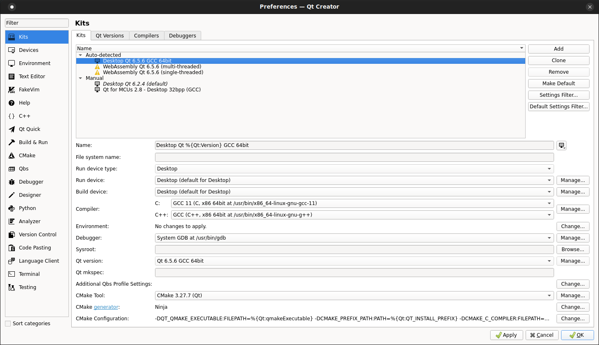

# QCVECheckReport

Tool that let analysis of CVE of a yocto generated image using information by CVECheck tool and is able to create a report readable on the screen and in PDF format

Author: Raffaele de Cicco <decicco.raffaele@gmail.com>

Developed as a research project during my working experience in COBO S.p.A. (https://www.cobogroup.net/en)

# Description
This tool is able to create a report to analyze CVE of a yocto build image using CVECheck json report and NVD CVE DB of NIST created by the same tool retrieving information by https://www.nist.gov/

# Prerequisite
* At least Qt Widgets 6.5.6 at 64 bits
* Pdf-Writer 4.6.2 (https://github.com/galkahana/PDF-Writer.git)
* SQLite 3.0

# Sources structure
- Sources:
	+ DAO: Data access objects. Classes that manages single tables of DB
	+ DTO: Data transfer object. Classes that contains data of each single table
	+ QSQLiteManager: main class to manage database access
	+ JsonCVECheckReportManager: main class to manage Json report generated by CVECheck tool
	+ MdiSubWindow: Subwindow of report imported with Json the let filtering and analysis of report information
	+ DialogImportCVEReport: Dialog to import CVE report and NVD DB inside application DB
	+ MdiPDFReport: Subwindow of report exportable in PDF format
	+ ReportData: Class that manage generation of HTML report shown inside MdiPDFReport window and generation of report in PDF format
	+ DialogImportCVEDB: Dialog to import an update of NVD DB
	+ MdiCVEData: Subwindow of CVE information of NVD CVE DB by NIST
	+ QCVECheckApp: Main class of application
	+ Main: Main application

# Build Notes
* QtCreator: configure project using Qt 6.5.6 Desktop 64 Bit Kit
* Qt 6.5.6 Kit Configuration:

# License
General Public License version 3.0 - [GPL v.3.0](gnu-gpl-v3.0.md)
