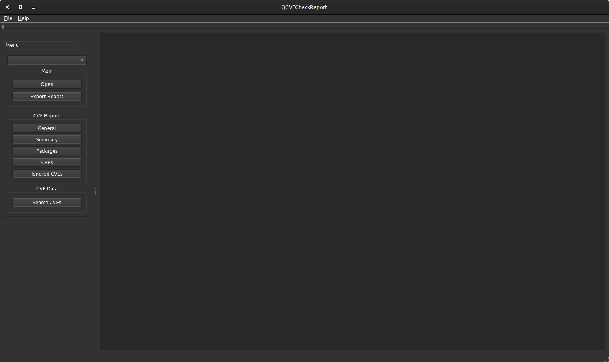
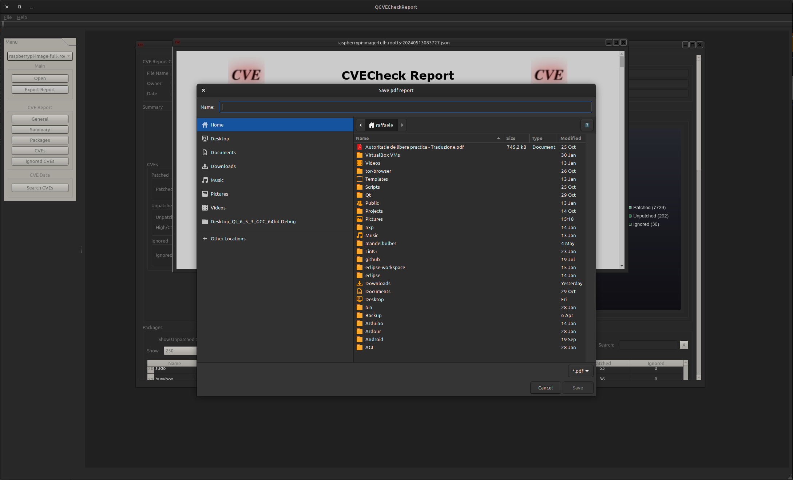

# Software Description
QCVECheckReport tool is able to import Json CVECheck report and show it in a more readable format to let analysis of issues, look for a possible solution following link of CVE, print a full report on the screen and in PDF format to attach to release documentation.

## Graphical Interface

The main window present a file menu that has following items:

* Open item let opening of Open Dialog: \

Open Dialog let you import Json report created by CVECheck tool and its associated NVDB DB by NIST

* Import CVE DB item let import a new version of NVDB DB independently by a Json report \

* Exit item let exit by QCVECheckReport application

After importing of Json Report, it's opened inside the MDI area.
Each report is shown in a different sub-window and is independent by any other.

Report shown inside MDI Window is divided in following sections:
* General Information
* Summary
* Packages
* CVEs
* Ignored CVEs

## General Information
General information contains json report file name, owner of file and last date of modification

## Summary
Summary section contains information about:
* Patched CVE: Already solved issues
* Unpatched CVE: Issues already present in the build
* Ignored CVE: Issues that have been ignored because it has been marked as ignorable
* Graph on the left shows unpatched CVE by Severity
* Graph on the right shows Packages with known CVEs

## Packages
Packages section contains information about packages affected by vulnerability issues

## CVEs
CVEs section contains information about all CVEs of build and let filter them, 
analyze its severity, and follow the link that open the web page of NIST about selected CVE which may contain the patch to solve it too:

NIST CVE web page "CVE-2024-45490 Detail":

## Ignored CVEs
Ignored CVEs section contains information about Ignored CVEs of build filter them, analyze its severity, and follow the link that open the web page of NIST about selected CVE which may contain the patch to solve it too:

## CVE Report Navigator
On the left of main window are present the buttons that let navigating of current CVE Report (as selected in the combo box on the top of menu).
Pressing a CVE navigator button, the report jumps directly to corresponding section:

## Export report
Pressing export report button on the left of main window, a MDI window is opened containing the full report in HTML format:

And it may be saved in PDF format too:

Here an example of generated [PDF Report](./Report.pdf "PDF Report")

## Search CVEs
Search CVEs button open an MDI Window that contains information about CVEs contained inside last NVD DB of NIST imported alone or with Json report of generated build

